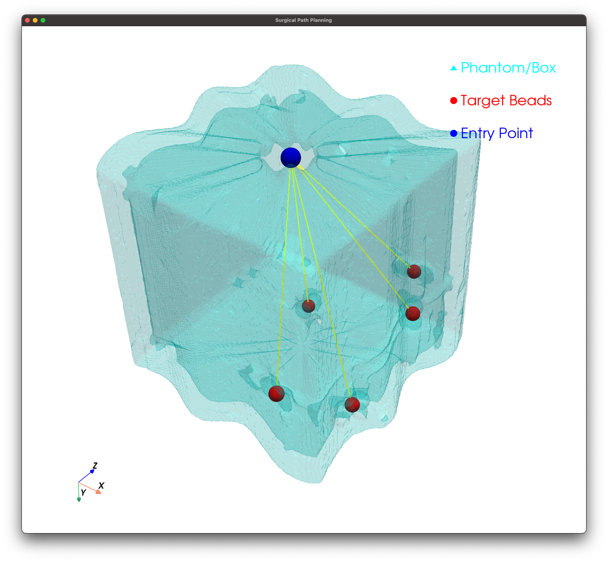
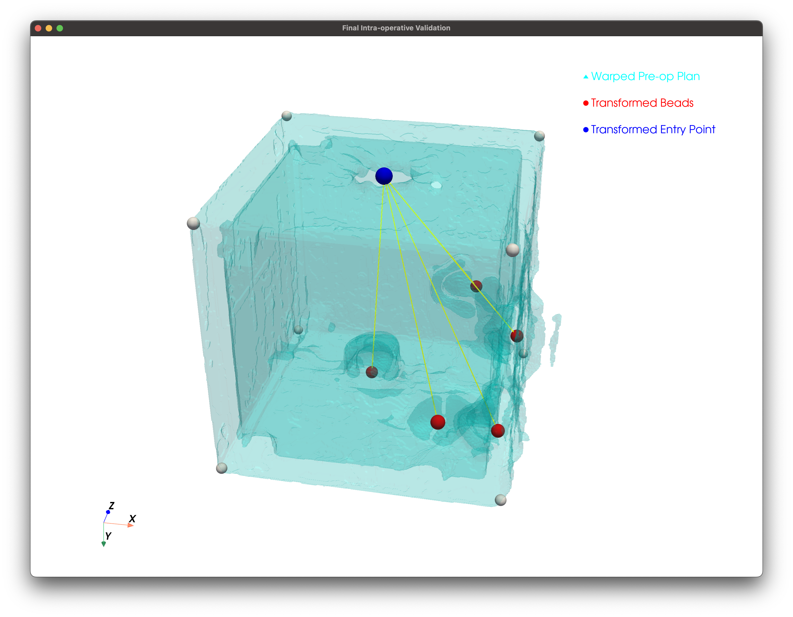

# Surgical Navigation Technology (201000262)

## Automated Marker Detection, Dual-Registration, and Trajectory Validation

[](https://www.python.org/)
[](https://github.com/InsightSoftwareConsortium/ITKElastix)
[](https://docs.pyvista.org/)

---

### Keywords & Tags

`Image Registration` `ITK-Elastix` `Rigid Transform` `B-Spline` `Trajectory Planning` `Automated Segmentation` `Histogram Peak Detection` `Target Registration Error (TRE)` `Surgical Planning`

---

## Project Overview

This project implements a high-precision pipeline for surgical navigation by aligning Pre-operative CT plans with Intra-operative patient scans. Utilizing a multi-stage registration approach (Euler + B-Spline), the system automatically detects fiducial markers (beads) and phantom boundaries to ensure that planned surgical trajectories are accurately projected onto the current patient situation.

---

## Methodology & Technical Highlights

### Box Segmentation (Phantom Structure)

* **Method:** Range-based thresholding (665-3850) followed by a **Histogram Peak Detection** approach.
* **Rationale:** The box is aligned with the scan axes. Analyzing voxel density along X, Y, and Z axes allows for robust boundary detection that ignores isolated noise.
* **Precision:** Added **KDTree Snapping** to ensure calculated corners are "snapped" to the nearest actual voxel on the physical box wall.

### Bead Segmentation (Markers)

* **Method:** Intensity thresholding (3820) + Morphological Opening (Ball radius 2) + Watershed Segmentation.
* **Noise Filtering:** Implemented a **Volume-based Filter** that retains only the 10 largest connected components. This effectively removes artifacts and "spook-beads."
* **Merging:** Iterative proximity merging (Agglomerative Clustering) to combine 10 detected beads into the 5 master marker centroids.

### Image Registration (ITK-Elastix)

* **Strategy:** Multi-resolution pipeline starting with a **Rigid (Euler)** pass followed by a **Non-rigid (B-Spline)** pass with 10mm grid spacing.
* **Initialization:** Used **Center-of-Gravity (COG)** alignment to ensure convergence despite large initial displacements.
* **Dual-Registration Pass:** To solve software limitations and maximize precision, the script runs registration twice:
  1. **Pass 1 (Image Warping)**: Aligns Pre-op to Intra-op to generate the correctly warped visualization.
  2. **Pass 2 (Point Mapping)**: Aligns Intra-op to Pre-op to allow mathematically precise point transformation from planning space to patient space using standard ITK filters.

---

## Visualizations

### Pre-operative Planning
Initial surgical path planning on the original Pre-op CT scan.


### Intra-operative Validation
Final validation showing the **Warped Pre-op Plan** and **Transformed Trajectories** projected into the Intra-operative patient space.


---

## Output & Persistence

All generated artifacts are stored in the `output/` directory. 

> **Warning:** Running the production scripts will **overwrite** existing files in the output folder.

### Key Output Files:
- **`CTpreop_registered.nii.gz`**: The Pre-op scan warped into the Intra-op coordinate space.
- **`transformed_coords.json`**: A structured JSON file containing the transformed voxel coordinates for the Entry Point, Target Beads, and Box Corners.
- **`beads_mask.nii.gz`**: The segmentation mask of the detected markers in the Pre-op scan.
- **`outputpoints.txt`**: The raw coordinate transformation results from ITK-Elastix.

---

## Software Structure

### Core Production Pipeline

These scripts form the final working pipeline:

1. **`scripts/process_beads_full_pipeline.py`**: Automatically detects the 5 markers in the pre-op scan. *Note: This is automatically called by the registration script, but can be run standalone for verification.*
2. **`scripts/register_and_transform.py`**: The main engine. Performs dual-registration and maps all planning points (Entry, Beads, Corners) to intra-op space.
3. **`scripts/visualize_intraop_trajectories.py`**: 3D PyVista validation. Shows the **warped Pre-op plan** and transformed surgical paths (yellow) overlaid on the patient's Intra-op coordinate space.
4. **`scripts/assess_registration_accuracy.py`**: Final quantitative report (TRE) comparing the transformed plan vs. ground-truth markers in the Intra-op scan.

### Development & Research Scripts

- **`scripts/get_box_corners_v2.py`**: Source for the histogram boundary detection logic. (Imported by `register_and_transform.py`).

### Prototypes & Verification

Located in `scripts/prototypes/`, these are standalone scripts used during development for testing and verification. **Note: Their core logic has been integrated into the main production pipeline**, but they are kept for modular testing:

- **`segment_beads.py`**: Isolates markers from the CT scan.
- **`plot_bead_centers.py`**: Visualizes detected centroids for accuracy checks.
- **`plan_trajectories.py`**: Pre-operative path planning visualization on the **original Pre-op scan**.

### Archive

Scripts located in `scripts/archive/` contain legacy logic or early prototypes with known errors (e.g., `calculate_errors.py`). They are preserved for historical reference but are not part of the active pipeline.

---

## Environment & How to Run

### Setup Environment

Replicate the stable environment using the provided `environment.yml`:

```bash
conda env create -f environment.yml
conda activate snt_stable
```

### Execution Pipeline

The entire process is integrated. You only need to run the registration engine to process points and images:

1. **Run Registration & Transformation**:
   (This step automatically runs bead detection and box corner extraction)
   
   ```bash
   python scripts/register_and_transform.py
   ```
2. **Visualize Final Plan on Patient**:
   
   ```bash
   python scripts/visualize_intraop_trajectories.py
   ```
3. **Generate Accuracy Report**:
   
   ```bash
   python scripts/assess_registration_accuracy.py
   ```

---

*Created for the Course: Surgical Navigation Technology (201000262)*
