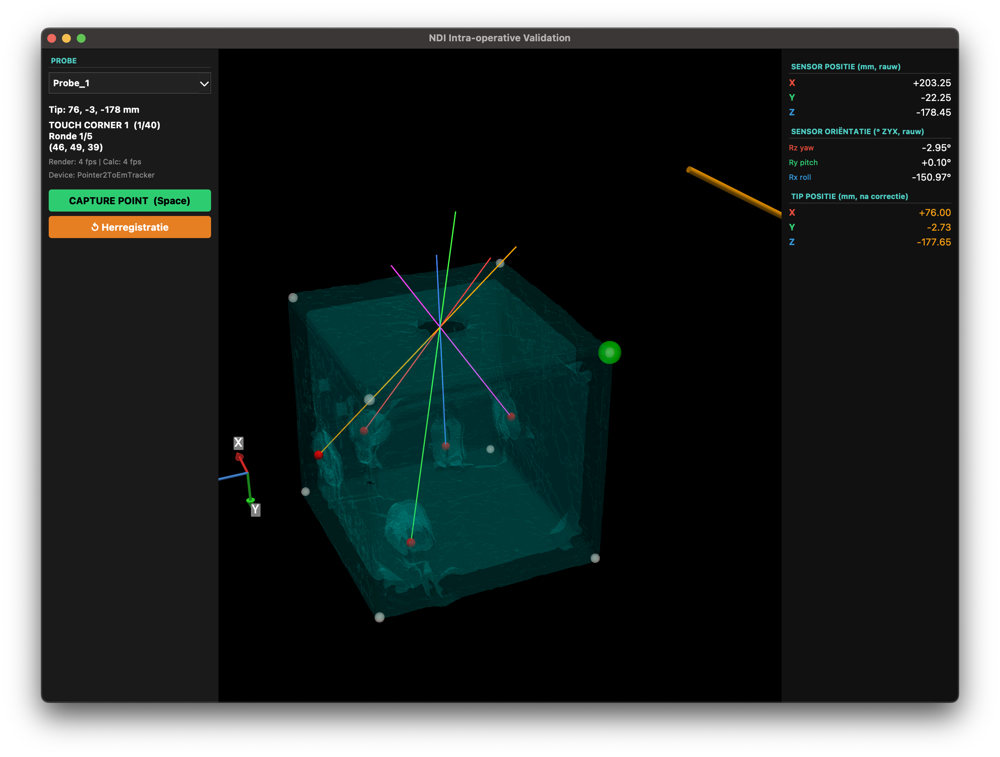

# Surgical Navigation Technology (201000262)

## Automated Marker Detection, Dual-Registration, and Trajectory Validation

[](https://www.python.org/)
[](https://github.com/InsightSoftwareConsortium/ITKElastix)
[](https://docs.pyvista.org/)

---

### Keywords & Tags

`Image Registration` `ITK-Elastix` `Rigid Transform` `B-Spline` `Trajectory Planning` `Automated Segmentation` `Histogram Peak Detection` `Target Registration Error (TRE)` `Surgical Planning`

---

## Project Overview

This project implements a complete, end-to-end surgical navigation framework composed of two distinct phases:

1. **Phase 1: Automated Planning & Registration (Pre-op -> Intra-op)**
   The system automatically extracts fiducial markers (beads) and phantom boundaries from Pre-operative CT scans. Using a dual-pass ITK-Elastix registration pipeline, it maps planned surgical trajectories onto the Intra-operative patient context, generating a mathematical target plan.
   
2. **Phase 2: Real-Time EM Tracking & Execution**
   The generated plan is directly loaded into a live navigation engine. By connecting to an NDI Electromagnetic (EM) tracking system, the surgeon can visualize the transformed 3D plan and physically guide instruments along the planned trajectories in real-time.

---

## Methodology & Technical Highlights

### Phase 1: Planning (Segmentation & Registration)

**Box Segmentation (Phantom Structure)**
* **Method:** Range-based thresholding (665-3850 HU) followed by a **Histogram Peak Detection** approach.
* **Rationale:** The box is aligned with the scan axes. Analyzing voxel density along orthogonal axes allows for robust boundary detection that ignores isolated noise.
* **Precision:** Added **KDTree Snapping** to ensure calculated corners are "snapped" to the nearest actual voxel on the physical box wall.

**Bead Segmentation (Markers)**
* **Method:** Intensity thresholding (>3820 HU) + Morphological Opening (Ball radius 2) + Watershed Segmentation.
* **Noise Filtering:** Implemented a **Volume-based Filter** that retains only the 10 largest connected components. This effectively removes artifacts and "spook-beads."
* **Merging:** Iterative proximity merging (Agglomerative Clustering) to combine 10 detected beads into the 5 master marker centroids.

**Image Registration (ITK-Elastix)**
* **Strategy:** Multi-resolution pipeline starting with a **Rigid (Euler)** pass followed by a **Non-rigid (B-Spline)** pass.
* **Initialization:** Used **Center-of-Gravity (COG)** alignment to ensure convergence despite large initial displacements.
* **Dual-Registration Pass:** The engine runs registration twice to overcome ITK limitations:
  1. **Image Warping**: Aligns Pre-op to Intra-op to generate the correctly warped visual volume.
  2. **Point Mapping**: Aligns Intra-op to Pre-op to allow precise analytical point transformation from planning space to patient space using standard ITK filters.

### Phase 2: Execution (EM Tracking & Navigation)

**Point-Based Registration (Procrustes / Kabsch)**
* **Method:** Aligns the dynamic, real-world EM sensor coordinates with the static target coordinates from the CT plan using Singular Value Decomposition (SVD) to find the optimal rigid transformation matrix.
* **Rationale:** Maps the physical pointer tip directly into the 3D mathematical space of the pre-operative plan.

**Geometric Noise Reduction (Cube-Fit)**
* **Method:** An advanced experimental constraint algorithm that forces raw, noisy NDI measurements of the phantom box into a mathematically perfect 50x50x50mm axis-aligned cube *prior* to Kabsch registration.
* **Rationale:** Suppresses Electromagnetic tracking jitter and severely reduces Error Amplification. *(Limitation: Requires the physical box to be placed perfectly parallel to the EM tabletop generator's axes).*

**Asynchronous UI Architecture**
* **Method:** Decouples the data-fetching layer from the 3D PyVista rendering layer using a multi-threaded architecture (`NDIReaderThread` and `TransformWorkerThread`).
* **Rationale:** While the EM tracker polls at ~10Hz, the GUI rendering loop operates independently at high speed (8ms updates). This eliminates interface latency, ensuring smooth, real-time surgical guidance even during rapid instrument movements.

---

## Visualizations

### Live Tracking Interface
Real-time 3D visualization and validation UI using NDI EM tracking.


### Pre-operative Planning
Initial surgical path planning on the original Pre-op CT scan.


### Intra-operative Validation
Final validation showing the **Warped Pre-op Plan** and **Transformed Trajectories** projected into the Intra-operative patient space.

---

## Output & Persistence

All generated artifacts are stored in the `output/` directory. 

> **Warning:** Running the production scripts will **overwrite** existing files in the output folder.

### Key Output Files:
- **`CTpreop_registered.nii.gz`**: The Pre-op scan warped into the Intra-op coordinate space.
- **`transformed_coords.json`**: A structured JSON file containing the transformed voxel coordinates for the Entry Point, Target Beads, and Box Corners.
- **`beads_mask.nii.gz`**: The segmentation mask of the detected markers in the Pre-op scan.
- **`outputpoints.txt`**: The raw coordinate transformation results from ITK-Elastix.

---

## Software Structure

### Phase 1: Planning & Registration Pipeline

These scripts form the offline engine that creates the surgical plan:

1. **`scripts/process_beads_full_pipeline.py`**: Automatically detects the 5 markers in the pre-op scan. *Note: This is automatically called by the registration script, but can be run standalone for verification.*
2. **`scripts/register_and_transform.py`**: The main engine. Performs dual-registration and maps all planning points (Entry, Beads, Corners) to intra-op space. Outputs the `transformed_coords.json` file.
3. **`scripts/visualize_intraop_trajectories.py`**: 3D PyVista validation. Shows the **warped Pre-op plan** and transformed surgical paths (yellow) overlaid on the patient's Intra-op coordinate space.
4. **`scripts/assess_registration_accuracy.py`**: Final quantitative report (TRE) comparing the transformed plan vs. ground-truth markers in the Intra-op scan.

### Phase 2: NDI EM Tracking & Execution

Located in `scripts/ndi_tracking/`, these tools load the generated `transformed_coords.json` plan and interface with the NDI Electromagnetic (EM) tracker for real-time surgical execution:

- **`read_ndi_stream.py`**: A CLI tool to test the connection and log tracking data. Pressing Enter marks specific "events" in the data stream. Logs are saved to `data/ndi_captures/`.
- **`gui_tracking_basic.py`**: Real-time 3D visualization of the EM sensor using PyVista and OpenIGTLink.
- **`gui_tracking_8_points.py`**: Validation tool that guides the user to touch 8 specific points (e.g., box corners) for accuracy assessment.
- **`experimental_cube_fit/`**: Contains enhanced tracking scripts (`gui_tracking_basic.py` and `gui_tracking_8_points.py`) featuring an advanced noise-reduction algorithm. It forces noisy NDI measurements into a perfect 50x50x50mm axis-aligned cube *prior* to the Kabsch registration, significantly improving tracking stability when the physical phantom box is aligned squarely with the EM tabletop generator. **Pitfall / Caveat:** This algorithm destroys actual rotation data to achieve noise reduction. If the physical box is placed diagonally or rotated relative to the EM generator's axes, the algorithm will squash the measurements into the wrong shape, causing severe registration errors.
- **`gui_offline_testing.py`**: A simulation/testing environment for verifying registration logic with pre-recorded or simulated tracking data.
- **`ndi_emulator.py`**: Simulates an NDI OpenIGTLink server for development without physical hardware.

### Development & Research Scripts

- **`scripts/get_box_corners_v2.py`**: Source for the histogram boundary detection logic. (Imported by `register_and_transform.py`).

### Prototypes & Verification

Located in `scripts/prototypes/`, these are standalone scripts used during development for testing and verification. **Note: Their core logic has been integrated into the main production pipeline**, but they are kept for modular testing:

- **`segment_beads.py`**: Isolates markers from the CT scan.
- **`plot_bead_centers.py`**: Visualizes detected centroids for accuracy checks.
- **`plan_trajectories.py`**: Pre-operative path planning visualization on the **original Pre-op scan**.

### Archive

Scripts located in `scripts/archive/` contain legacy logic or early prototypes with known errors (e.g., `calculate_errors.py`). They are preserved for historical reference but are not part of the active pipeline.

---

## Environment & How to Run

### Setup Environment

Replicate the stable environment using the provided `environment.yml`:

```bash
conda env create -f environment.yml
conda activate snt_stable
```

### Execution Workflow

The entire surgical workflow is strictly divided into the planning phase and the execution phase:

#### Phase 1: Plan Generation (Offline)
1. **Run Registration & Transformation**:
   (Automatically runs bead detection, extracts corners, and outputs the `transformed_coords.json` plan)
   ```bash
   python scripts/register_and_transform.py
   ```
2. **Verify Plan**:
   ```bash
   python scripts/visualize_intraop_trajectories.py
   ```

#### Phase 2: Surgical Execution (Live Navigation)
3. **Launch Real-Time Tracking UI**:
   (Connects to the EM tracker, loads the generated plan, and starts live guidance)
   ```bash
   python scripts/ndi_tracking/gui_tracking_basic.py
   ```

---

*Created for the Course: Surgical Navigation Technology (201000262)*
